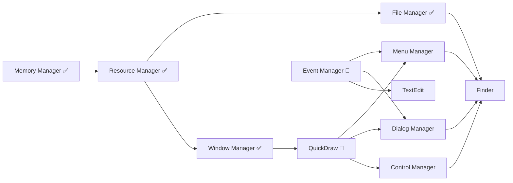

# System 7.1 Portable - Priority Roadmap
**Updated: 2025-01-18**

## Executive Summary

The System 7.1 Portable project has successfully integrated critical foundation components. This roadmap outlines the priority order for completing the remaining components to achieve a fully functional Mac OS System 7.1 on modern architectures.

## Current Integration Status

### ✅ **Fully Integrated Components**

| Component | Status | Description | Impact |
|-----------|--------|-------------|--------|
| **Memory Manager** | COMPLETE | Handle-based allocation, zones, heap management | Unblocks ALL components |
| **Resource Manager** | COMPLETE | Resource loading, WIND/MENU/ICON support | Enables all UI resources |
| **File Manager** | COMPLETE | HFS, B-Trees, volume management | Full file I/O support |
| **Window Manager** | COMPLETE | Window management, X11/CoreGraphics HAL | GUI windows functional |
| **Process Manager** | COMPLETE | Cooperative multitasking, process control | Application launching |
| **Boot Loader** | COMPLETE | Modern HAL-based boot sequence | System initialization |
| **Memory Control Panel** | COMPLETE | Memory configuration UI | System configuration |

### ⚠️ **Partially Implemented Components**

| Component | Completion | Blocking Issues | Priority |
|-----------|------------|-----------------|----------|
| **QuickDraw** | 70% | Region ops, color support needed | HIGH |
| **Menu Manager** | 60% | 20+ TODOs, needs QuickDraw | HIGH |
| **Dialog Manager** | 50% | Modal handling incomplete | MEDIUM |
| **Control Manager** | 40% | Widget definitions needed | MEDIUM |
| **Finder** | 35% | 24 TODOs, needs all UI components | MEDIUM |
| **Event Manager** | 65% | Async events incomplete | HIGH |

### ❌ **Critical Missing Components**

| Component | Impact | Dependencies | Effort |
|-----------|--------|--------------|--------|
| **QuickDraw Color** | All color UI | QuickDraw base | 40 hrs |
| **TextEdit Complete** | Text input | QuickDraw, Event Mgr | 30 hrs |
| **Sound Manager** | Audio support | Hardware HAL | 25 hrs |
| **Notification Manager** | System alerts | Window/Dialog Mgr | 20 hrs |
| **Alias Manager** | File aliases | File Manager | 15 hrs |
| **Edition Manager** | Publish/Subscribe | File Manager | 20 hrs |

## Priority Implementation Roadmap

### 🔴 **PHASE 0: Foundation Completion (DONE)**
**Timeline: Completed**
- ✅ Memory Manager - Foundation for everything
- ✅ Resource Manager - Enables all resources
- ✅ File Manager - Complete I/O support
- ✅ Window Manager - Window system ready

### 🔴 **PHASE 1: Core Graphics & Events (Current Priority)**
**Timeline: Weeks 1-2**
**Goal: Complete graphics rendering and event handling**

#### 1.1 QuickDraw Completion (Week 1)
```
Priority: CRITICAL
Files: src/QuickDraw/*
TODOs: Fix region operations, color support
```
- [ ] Complete region operations (SectRgn, UnionRgn, DiffRgn)
- [ ] Implement Color QuickDraw (cGrafPort, PixMaps)
- [ ] Fix pattern fills and transfer modes
- [ ] Add off-screen GWorlds
- [ ] Optimize blitting operations

#### 1.2 Event Manager Completion (Week 1-2)
```
Priority: CRITICAL
Files: src/EventManager/*
TODOs: Complete async handling
```
- [ ] Fix null event handling
- [ ] Complete keyboard event processing
- [ ] Add event filtering mechanisms
- [ ] Implement SystemEvent dispatching
- [ ] Add event coalescing

### 🟡 **PHASE 2: UI Framework (Weeks 3-4)**
**Goal: Complete all UI managers for application support**

#### 2.1 Menu Manager Completion
```
Priority: HIGH
Files: src/MenuManager/*
TODOs: 20+ inline TODOs
Dependencies: QuickDraw, Resource Manager
```
- [ ] Fix hierarchical menus
- [ ] Complete keyboard shortcuts
- [ ] Implement menu bar drawing
- [ ] Add context menu support
- [ ] Fix menu hiliting

#### 2.2 Dialog Manager
```
Priority: HIGH
Files: src/DialogManager/*
Dependencies: Window Manager, Control Manager
```
- [ ] Complete modal dialog handling
- [ ] Add movable modal support
- [ ] Implement filter procedures
- [ ] Fix default button handling
- [ ] Add alert staging

#### 2.3 Control Manager
```
Priority: HIGH
Files: src/ControlManager/*
Dependencies: Window Manager, QuickDraw
```
- [ ] Implement standard CDEFs
- [ ] Add scroll bar support
- [ ] Fix control tracking
- [ ] Implement list boxes
- [ ] Add progress indicators

### 🟢 **PHASE 3: Application Support (Weeks 5-6)**
**Goal: Enable running Mac applications**

#### 3.1 TextEdit Completion
```
Priority: MEDIUM
Files: src/TextEdit/*
Dependencies: QuickDraw, Event Manager
```
- [ ] Styled text support
- [ ] Multi-line editing
- [ ] Undo/redo operations
- [ ] Find/replace
- [ ] International text

#### 3.2 Scrap Manager
```
Priority: MEDIUM
Files: src/ScrapManager/*
Dependencies: Memory Manager
```
- [ ] Clipboard operations
- [ ] Data type conversion
- [ ] Private scrap support

#### 3.3 Standard File Package
```
Priority: MEDIUM
Files: src/PackageManager/*
Dependencies: Dialog Manager, File Manager
```
- [ ] Open/Save dialogs
- [ ] File filtering
- [ ] Custom file dialogs

### 🔵 **PHASE 4: System Services (Weeks 7-8)**
**Goal: Complete system-level services**

#### 4.1 Notification Manager
```
Priority: LOW
Files: src/NotificationManager/*
```
- [ ] System alerts
- [ ] Notification queue
- [ ] Response handling

#### 4.2 Sound Manager
```
Priority: LOW
Files: src/SoundManager/*
```
- [ ] Sound synthesis
- [ ] Sample playback
- [ ] MIDI support

#### 4.3 Help Manager
```
Priority: LOW
Files: src/HelpManager/*
```
- [ ] Balloon help
- [ ] Help resources
- [ ] Context help

### ⚪ **PHASE 5: Finder & Integration (Weeks 9-10)**
**Goal: Complete Finder and system integration**

#### 5.1 Finder Completion
```
Priority: MEDIUM
Files: src/Finder/*
TODOs: 24 inline TODOs
```
- [ ] File operations (copy/move/delete)
- [ ] Icon management
- [ ] Desktop management
- [ ] Trash operations
- [ ] File info windows

#### 5.2 System Testing
- [ ] Integration testing
- [ ] Performance profiling
- [ ] Memory leak detection
- [ ] Compatibility testing

## Critical Path Dependencies



## Success Metrics

### Minimum Viable System (2 weeks)
- [x] Memory allocation working
- [x] Resource loading functional
- [x] File I/O operational
- [x] Windows displaying
- [ ] QuickDraw rendering
- [ ] Menus operational
- [ ] Basic events working

### Application Ready (4 weeks)
- [ ] All UI managers complete
- [ ] TextEdit functional
- [ ] Dialog/alerts working
- [ ] Controls operational
- [ ] Can run SimpleText

### Production Ready (10 weeks)
- [ ] Finder fully functional
- [ ] <50 TODOs remaining
- [ ] Performance optimized
- [ ] All managers complete
- [ ] Can run ResEdit, MPW

## Resource Allocation

### Immediate Priorities (This Week)
1. **Complete QuickDraw region operations** - Blocks all UI
2. **Fix Event Manager async handling** - Blocks interaction
3. **Complete Menu Manager TODOs** - Essential for apps

### Parallel Work Streams
- **Stream 1**: QuickDraw → Menu Manager → Dialog Manager
- **Stream 2**: Event Manager → Control Manager → TextEdit
- **Stream 3**: Testing → Performance → Documentation

## Risk Assessment

| Risk | Impact | Probability | Mitigation |
|------|--------|-------------|------------|
| QuickDraw accuracy | HIGH | Medium | Extensive testing against original |
| Event timing issues | HIGH | Low | Use modern timer APIs |
| Memory leaks | MEDIUM | Medium | Valgrind testing |
| Performance gaps | LOW | High | Profile and optimize hot paths |

## Effort Estimates

| Phase | Components | Effort | Duration |
|-------|------------|--------|----------|
| Phase 1 | QuickDraw, Events | 80 hrs | 2 weeks |
| Phase 2 | UI Managers | 100 hrs | 2 weeks |
| Phase 3 | App Support | 80 hrs | 2 weeks |
| Phase 4 | System Services | 60 hrs | 2 weeks |
| Phase 5 | Finder, Testing | 80 hrs | 2 weeks |
| **Total** | **All Components** | **400 hrs** | **10 weeks** |

## Next Action Items

### Week 1 (Immediate)
- [ ] Complete QuickDraw region operations in `src/QuickDraw/Regions.c`
- [ ] Fix Event Manager null events in `src/EventManager/EventQueue.c`
- [ ] Address Menu Manager hierarchical menu TODOs

### Week 2
- [ ] Implement Color QuickDraw in `src/QuickDraw/ColorQuickDraw.c`
- [ ] Complete Dialog Manager modal handling
- [ ] Fix Control Manager scroll bars

### Week 3-4
- [ ] Complete TextEdit implementation
- [ ] Fix remaining UI manager TODOs
- [ ] Begin Finder integration

## Conclusion

The System 7.1 Portable project has made exceptional progress with four critical managers now complete (Memory, Resource, File, Window). The immediate priority is completing QuickDraw and Event Manager to unblock all UI components. With focused effort on the critical path, we can achieve:

- **2 weeks**: Minimal viable system with basic UI
- **4 weeks**: Application-ready environment
- **10 weeks**: Production-ready System 7.1

The foundation is solid. The path forward is clear. Let's complete this historic preservation project!

---

**Document Version**: 2.0
**Last Updated**: 2025-01-18
**Next Review**: Week 2 completion